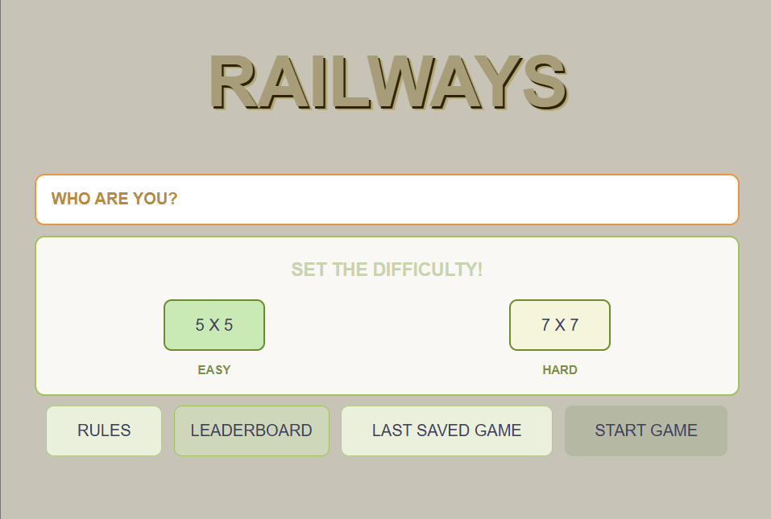
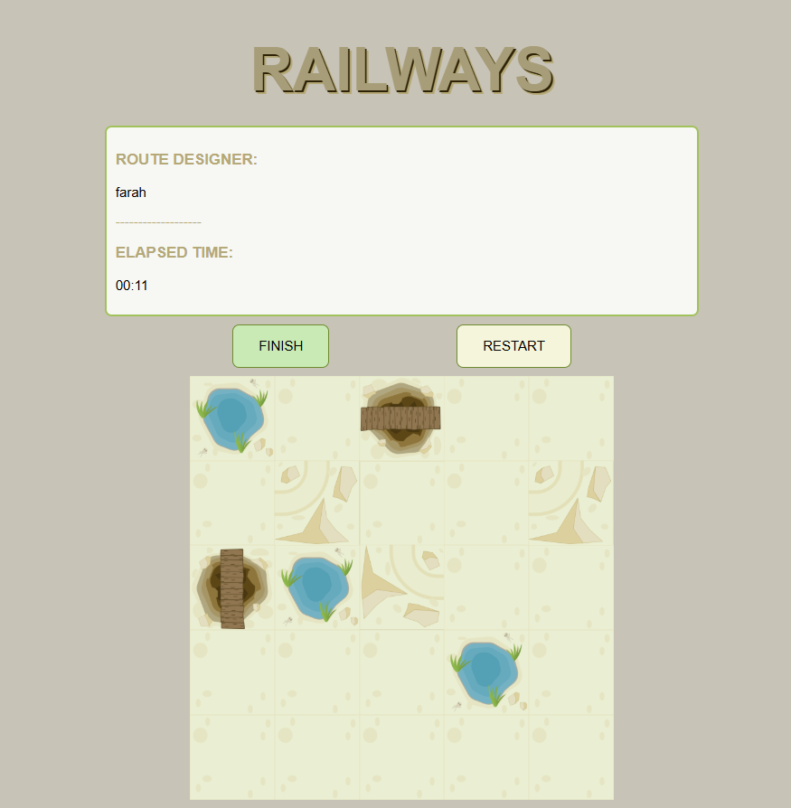
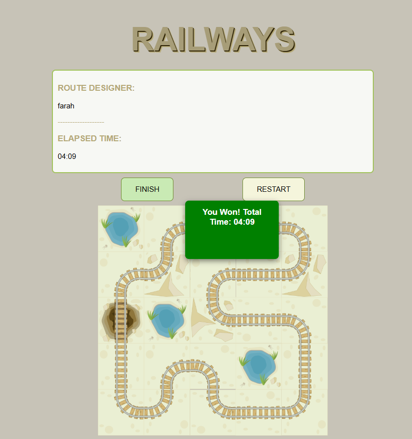
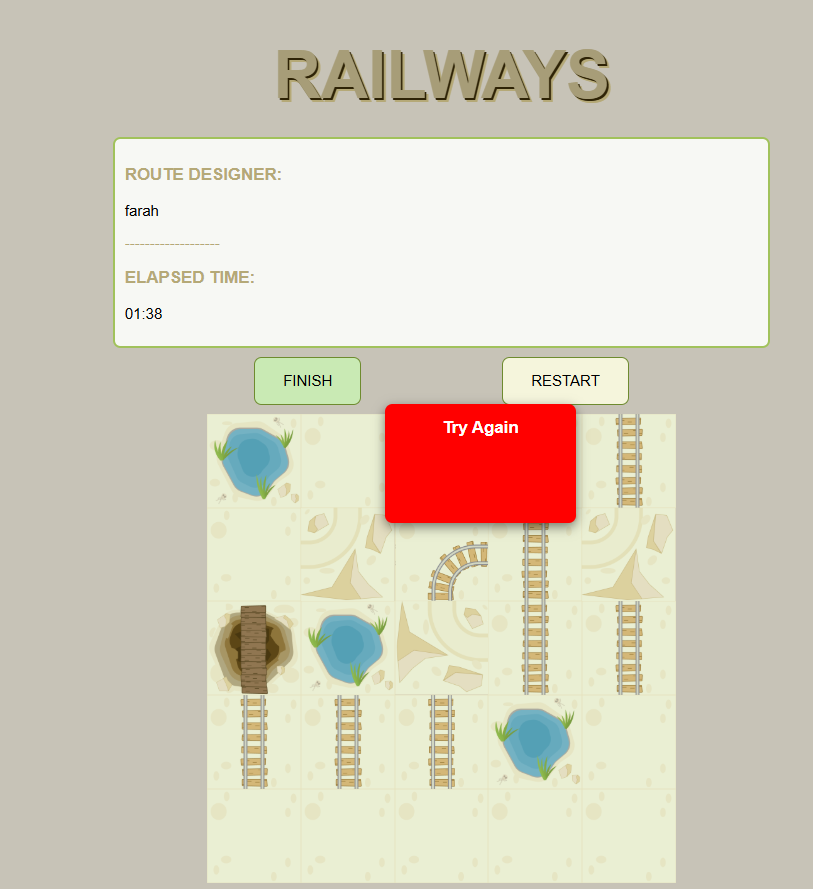
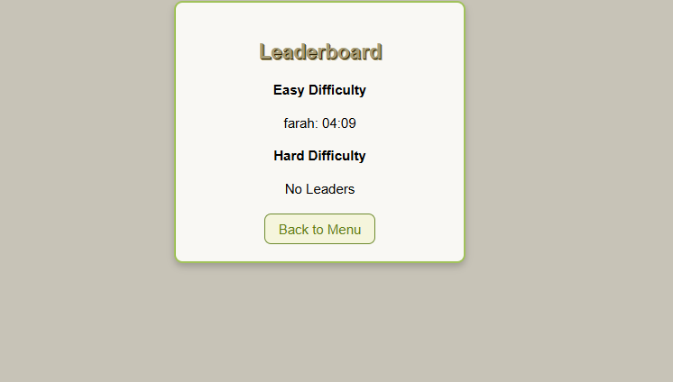

# 🚄 Railways Puzzle Game

A puzzle game built with **HTML**, **CSS**, and **Vanilla JavaScript** where players design railway tracks across dynamic terrains under different difficulty levels.

---

## 🔧 How to Play

- Enter your name in the menu.
- Select your desired difficulty: 
  - Easy: 5x5 grid
  - Hard: 7x7 grid
- Click **Start Game** to begin.
- Build railway tracks by clicking on the grid cells, following terrain rules:
  - **Bridge**: Only straight rails allowed.
  - **Mountain**: Only 90° turns allowed.
  - **Oasis**: No railway allowed.
  - **Empty**: Any direction except entry.
- Hold and drag the mouse to draw tracks continuously.
- Click **Finish** to validate your design.
- Time is tracked, and your score is saved on the leaderboard.

---

## 💡 Game Features

- ✨ Dynamic random maps based on difficulty
- ✨ Interactive railway construction
- ✨ Validation of path continuity and rules
- ✨ Timer to measure completion time
- ✨ Save and Load last game state
- ✨ Leaderboard with persistent storage via LocalStorage
- ✨ Beautiful and user-friendly interface

---
## 🎨 Screenshots

### 🏴 Game Start

### 🌫️ How The Easy puzzle Looks Like

### 🏆 Win Screen

### 🏆 Lost Screen

### 🏅 Leaderboard Screen

